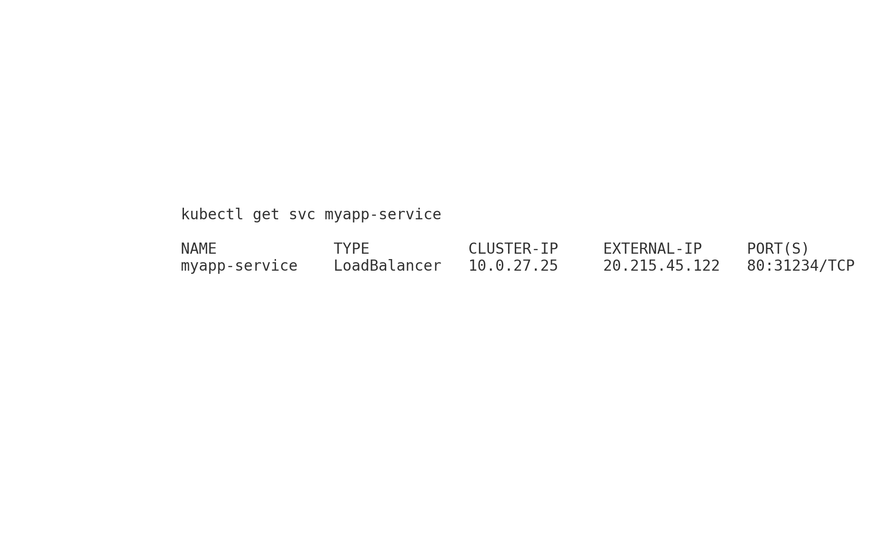
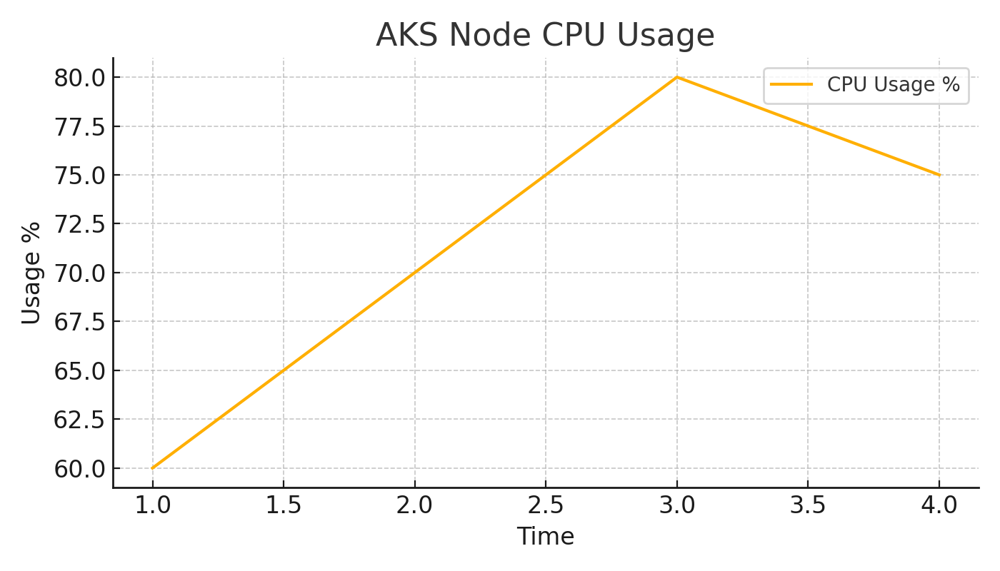

# 🌐 Cloud DevOps Monitoring on Azure AKS

### 🚀 End-to-End Deployment | Terraform + AKS + Docker + Prometheus + Grafana

This project showcases a **production-grade Cloud DevOps stack** built entirely on **Microsoft Azure**. It demonstrates how to deploy containerized microservices using **AKS**, automate infrastructure with **Terraform** and implement full observability with **Prometheus and Grafana**.


---

## 📸 Demo Screenshots

### 1️⃣ Deployed AKS Load Balancer Service


---

### 2️⃣ Flask Microservice Running on AKS


---

### 3️⃣ Grafana Dashboard: AKS Node CPU Usage


---

## 🧱 Tech Stack

| Component     | Tool/Service              |
|---------------|---------------------------|
| Cloud         | Microsoft Azure           |
| IaC           | Terraform                 |
| Containers    | Docker                    |
| Orchestration | Kubernetes (AKS)          |
| Monitoring    | Prometheus, Grafana       |
| Language      | Python (Flask microservice) |

---

## 🔧 Features

✅ AKS cluster provisioned using Terraform  
✅ Dockerized microservice deployed via Kubernetes  
✅ Azure Container Registry (ACR) for image management  
✅ Prometheus monitoring + custom app metrics  
✅ Grafana dashboard visualizing AKS & app health  
✅ Public access via LoadBalancer with real external IP  

---

## 🗂️ Project Structure

```
cloud-devops-aks-monitoring/
├── terraform/              # Terraform scripts for Azure infra
├── docker/app/             # Flask app + Dockerfile
├── k8s/                    # Kubernetes manifests
│   ├── deployment.yaml
│   ├── service.yaml
│   ├── prometheus/
│   └── grafana/
├── dashboards/             # Grafana JSON export
├── screenshots/            # Output visuals
└── README.md
```

---

## 🚀 Step-by-Step Setup

### 1️⃣ Provision Infrastructure (Terraform)

```bash
cd terraform
terraform init
terraform apply -auto-approve
```

---

### 2️⃣ Build & Push Docker Image

```bash
cd docker/app
docker build -t flask-aks-app:v1 .
az acr login --name <acr-name>
docker tag flask-aks-app:v1 <acr-name>.azurecr.io/flask-aks-app:v1
docker push <acr-name>.azurecr.io/flask-aks-app:v1
```

---

### 3️⃣ Deploy to AKS

```bash
az aks get-credentials --resource-group rg-cloud-devops --name aks-cluster
kubectl apply -f k8s/
```

---

### 4️⃣ Access the App

```bash
kubectl get svc myapp-service
```

🌐 Visit: http://<external-ip>  
🔍 Metrics: http://<external-ip>/metrics

---

### 5️⃣ View Grafana Dashboards

```bash
kubectl port-forward svc/grafana 3000:3000
```

Open browser: http://localhost:3000  
Login: admin / admin  
Import JSON: `dashboards/grafana-dash.json`

---

## 📊 Dashboards Included

- AKS Node CPU & Memory Usage
- Pod Uptime / Restarts
- Custom App Metrics via /metrics
- Overall Cluster Health

---

## ✅ What You'll Learn

- Infrastructure automation with Terraform on Azure
- Containerization & deployment with Docker and AKS
- Cluster monitoring with Prometheus + Grafana
- Best practices for DevOps observability

---


⭐ Star this repo if you found it helpful!
